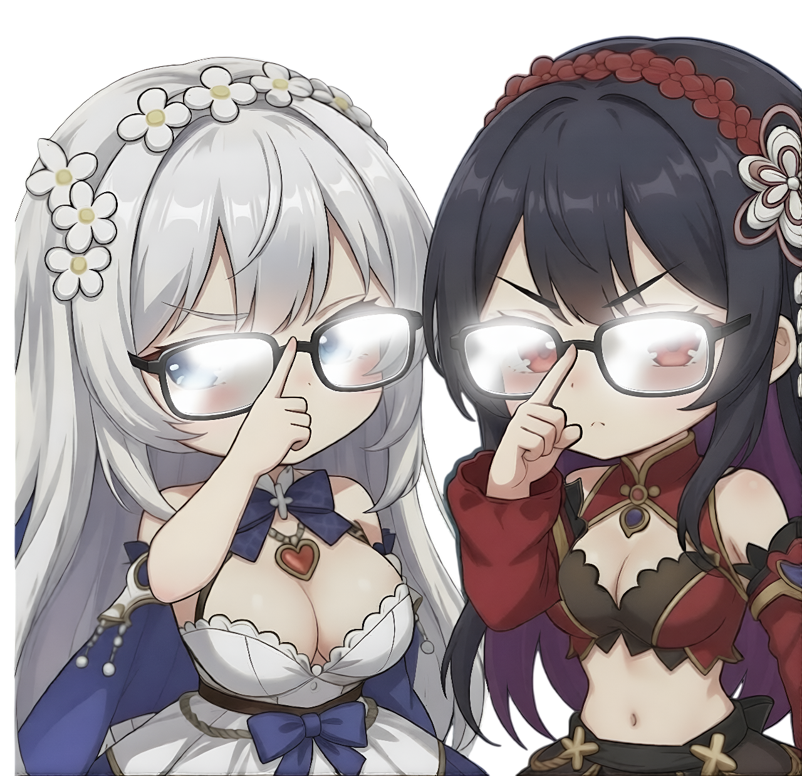

# 👒 Equipment


{% column width="66.66666666666666%" %}

## Equipment&#x20;

Has 6 pieces and 4 rarity: R - SR - SSR - UR

* R is most common for F2P and newbies.
* SR is hard to collect with limited resources and not worth exchanging.
* SSR is best set to build at the moment.
* UR is only worth building after having all the SSR sets you need.



{% column width="33.33333333333334%" %}

<figure><figcaption></figcaption></figure>





{% column width="58.333333333333336%" %}

## Resouces

<a class="button primary">Takoyaki</a> 40 tickets, 40 SR, 30 SSR

<a class="button primary">Pinnacle</a> \~100 SSR, \~20 SR

<a class="button primary">Roulette</a>

<a class="button primary">Treasure Expadition</a> ? SSR,? UR Based on your luck



{% column width="41.666666666666664%" %}

## Special Set

Every mgl season will release a new special set for SSR and UR, and require 6 pieces of star cores to craft.





